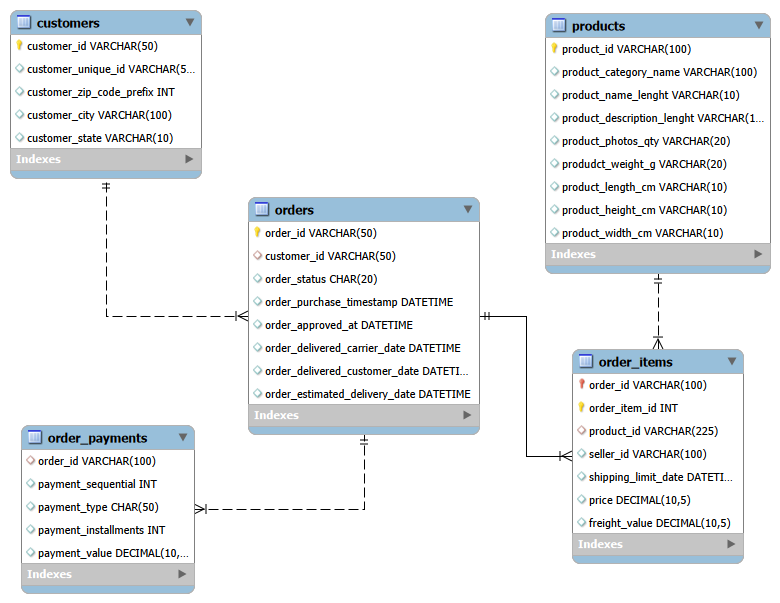

# 🇧🇷 Brazilian E-commerce SQL Analysis Project

## 📌 Project Overview

This project analyzes a Brazilian e-commerce dataset using SQL to extract meaningful business insights.
It focuses on understanding customer behavior, sales performance, and revenue trends.

---

## 🎯 Objectives

* Analyze order patterns and customer behavior
* Identify top-performing products and cities
* Calculate total revenue and average order value
* Understand payment methods used by customers
* Track monthly sales and revenue trends

---

## 🗂️ Dataset Description

The dataset consists of multiple related tables:

* customers – customer demographic details
* orders – order information and timestamps
* order_items – product-level order details
* products – product information and categories
* order_payments – payment details for each order

---

## 🏗️ Database Design

* Created relational database using MySQL
* Defined Primary Keys and Foreign Keys
* Established relationships between tables

---

## 🔗 Entity Relationship Diagram (ERD)



---

## 📊 Key Analysis Performed

### 1. Order Analysis

* Total number of orders by status
* Monthly order trends

### 2. Revenue Analysis

* Total revenue generated
* Revenue by payment type
* Monthly revenue trends

### 3. Customer Insights

* Top 10 customers based on spending
* Top cities with highest number of orders

### 4. Product Insights

* Top 10 best-selling products
* Price distribution

### 5. Order Value Analysis

* Highest value orders
* Average order value

---

## 🛠️ Tools Used

* SQL (MySQL)
* MySQL Workbench

---

## 📁 Project Structure

```
brazilian-ecommerce-sql-analysis/
│
├── sql/
│   └── project.sql
│
├── images/
│   └── er-diagram.png
│
└── README.md
```

---

## 🚀 SQL Concepts Used

* Joins
* Aggregations (SUM, COUNT, AVG)
* Group By
* Order By
* Date Functions (MONTHNAME)
* Data Cleaning (NULLIF)
* Constraints (PRIMARY KEY, FOREIGN KEY)

---

## 📈 Key Insights

* Top cities contribute significantly to overall revenue
* A small group of customers drives high sales
* Certain products dominate total sales volume
* Monthly trends indicate variations in demand
* Payment methods influence revenue distribution

---

## 📬 Author

Mukesh Hari
Aspiring Data Analyst

---

